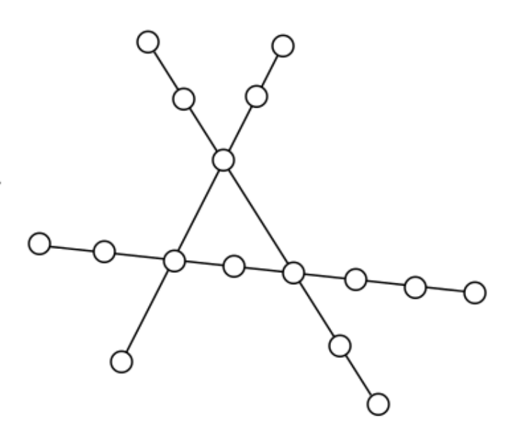

# Code Challenge Trains

* You are given 3 railways with train stations
* There is a single train on each rail
* Each train can carry n passengers
* Upon reaching a terminus station, a train will change direction
* All trains take the same amount of time from one station to another
* When two trains meet at a junction, the one with fewer passengers will wait until the
other moved on

# Task

Use javascript to code the scenario.

# Assumtions

* at each train station the amount of passengers alters by a random number

# View solution

1. checkout this repository
2. run **`npm install`** in command line
3. run **`npm start`** in command line
4. open [http://localhost:3000/](http://localhost:3000/) in your (modern) browser
